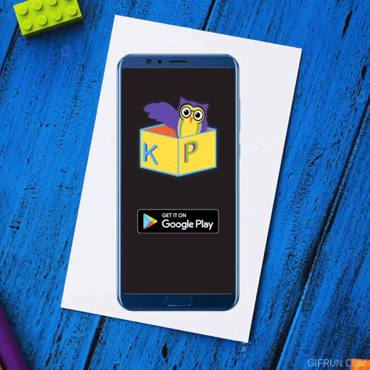

**[Știi Cuvinte?](https://play.google.com/store/apps/details?id=com.potterdev.balloonsynonyms)**

A romanian children's mobile game built in Unity for iOS and Android.

## How to play
Play and learn new words and languages

Multiple game modes

- Synonyms
- Antonyms
- Paronyms
- English - Romanian
- German - Romanian

As you progress, you reach different levels of difficulty:
Difficulty - School Year - Age
  Easy 1 7-8
  Medium 2 8-9
  Hard 3 9-10

Some later levels are locked under in-game purchase.

## How to build
Use Unity version 2020.3.2f1 to open Games/Balloons/BalloonSynonyms and build.

Also check out [this file](Games/Infrastructure/azure-pipelines-ios.yml) for ios builds in azure devops.

## License
MIT License

Copyright (c) 2023 SHOPSOFT SRL

Permission is hereby granted, free of charge, to any person obtaining a copy
of this software and associated documentation files (the "Software"), to deal
in the Software without restriction, including without limitation the rights
to use, copy, modify, merge, publish, distribute, sublicense, and/or sell
copies of the Software, and to permit persons to whom the Software is
furnished to do so, subject to the following conditions:

The above copyright notice and this permission notice shall be included in all
copies or substantial portions of the Software.

THE SOFTWARE IS PROVIDED "AS IS", WITHOUT WARRANTY OF ANY KIND, EXPRESS OR
IMPLIED, INCLUDING BUT NOT LIMITED TO THE WARRANTIES OF MERCHANTABILITY,
FITNESS FOR A PARTICULAR PURPOSE AND NONINFRINGEMENT. IN NO EVENT SHALL THE
AUTHORS OR COPYRIGHT HOLDERS BE LIABLE FOR ANY CLAIM, DAMAGES OR OTHER
LIABILITY, WHETHER IN AN ACTION OF CONTRACT, TORT OR OTHERWISE, ARISING FROM,
OUT OF OR IN CONNECTION WITH THE SOFTWARE OR THE USE OR OTHER DEALINGS IN THE
SOFTWARE.
